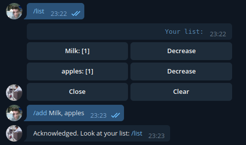

My personal telegram bot
====

## Modules
✔ - implemented

✘ - not yet

+ Convenient buy list ✘
    + /add ✔
    + /list ✔
    + callback on list ✔
    + update list after adding ✘
    + Nice response messages ✘
    
    

+ Cleaning reminder ✘
    + /nextcleaning ✘
    + /setbuilding ✔
    + /setreminder ✘
    + Nice response messages ✘

## How to start
1. Setup `.evn` file:
```
BOT_TOKEN=111111111:AAAAAAAAAAAAAAAAAAAAAAAAAAAAAAAAAAA
```
2. Start the bot using docker:

```bash
$ docker-compose up --build -d
```
