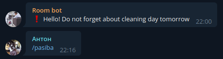

My personal telegram bot
====

Current avaliavle on [@roomInnoBot](http://t.me/roomInnoBot) in testing mode

## Modules

+ Convenient buy list
    + /add
    + /list
    + Callback on list
    + Update previous 5 lists after changing or adding
    
    

+ Cleaning reminder 
    + /nextcleaning
    + /setbuilding
    + /setreminder
    + /schedule
    
    
    

+ Default module
    + /start, /help, /cancel

+ Admin module
    + #restart

## Requirements
+ [docker](https://www.docker.com/get-started)
+ [docker-compose](https://docs.docker.com/compose/install/)

## How to start
1. Setup `.evn` file 
    + Create `.env` file in root directory: `mv .env.example .env`
    + Fill the file using your telegram token, admin alias, etc

2. Start the bot using docker:
```bash
$ ./forever_run.sh
```

## How to create your own module

1. Create a directory in `modules/` with name of your module

2. Create a `__init__.py` file in the directory of your module

3. Write a `setup` function that will register all your handlers in the bot:
```python
def setup(dp: Dispatcher, *args, **kwargs):
    dp.register_message_handler(your_cmd_function, Command('your_cmd'))
```
4. Create `message.py` file in the directory of your module. Use it to store all your text messages

5. Attach the module to the bot in `bot.py` file:

```python
from modules.your_module import setup as setup_your_module

#...

if __name__ == '__main__':
    setup_your_module(dp)
```
6. Implement all your thoughts!
    + import constants and utils from modules.common
    + add/change Models from modules.database.models
    + add dependencies in the `requirements.txt`

